  

<picture>
  <source media="(prefers-color-scheme: dark)" srcset="./ascii_photo_dark.svg">
  <source media="(prefers-color-scheme: light)" srcset="./ascii_photo_light.svg">
  
</picture>

rendered in pure ASCII — no image files, just characters ✨

 

## 💻 whoami

<picture>
  <source media="(prefers-color-scheme: dark)" srcset="./dark_mode_card.svg">
  <source media="(prefers-color-scheme: light)" srcset="./light_mode_card.svg">
  
</picture>

💡 This card auto-switches with your GitHub color scheme (Settings → Appearance).

  

## 📊 GitHub Stats

<picture>
  <source media="(prefers-color-scheme: dark)" srcset="https://github-readme-stats.vercel.app/api?username=MITHIL-07&show_icons=true&hide_border=true&count_private=true&bg_color=0b1024&title_color=a78bfa&icon_color=22d3ee&text_color=e5e7eb&border_color=7c3aed">
  <source media="(prefers-color-scheme: light)" srcset="https://github-readme-stats.vercel.app/api?username=MITHIL-07&show_icons=true&hide_border=true&count_private=true&bg_color=f5f3ff&title_color=6d28d9&icon_color=0891b2&text_color=1e1b3a&border_color=c4b5fd">
  
</picture>

<picture>
  <source media="(prefers-color-scheme: dark)" srcset="https://github-readme-stats.vercel.app/api/top-langs/?username=MITHIL-07&layout=compact&hide_border=true&bg_color=0b1024&title_color=a78bfa&text_color=e5e7eb&border_color=7c3aed">
  <source media="(prefers-color-scheme: light)" srcset="https://github-readme-stats.vercel.app/api/top-langs/?username=MITHIL-07&layout=compact&hide_border=true&bg_color=f5f3ff&title_color=6d28d9&text_color=1e1b3a&border_color=c4b5fd">
  
</picture>

<picture>
  <source media="(prefers-color-scheme: dark)" srcset="https://github-readme-streak-stats.herokuapp.com/?user=MITHIL-07&hide_border=true&background=0B1024&ring=8B5CF6&fire=22D3EE&currStreakLabel=E5E7EB&currStreakNum=E5E7EB&sideNums=A78BFA&sideLabels=64748B&dates=64748B">
  <source media="(prefers-color-scheme: light)" srcset="https://github-readme-streak-stats.herokuapp.com/?user=MITHIL-07&hide_border=true&background=F5F3FF&ring=7C3AED&fire=0891B2&currStreakLabel=1E1B3A&currStreakNum=1E1B3A&sideNums=6D28D9&sideLabels=64748B&dates=64748B">
  
</picture>

 

## 🧩 LeetCode Stats

  

 

## 🚀 Projects

| Project | Description |
|---|---|
| 🎓 **[Smart Campus Assistant System](https://github.com/MITHIL-07)** | First-semester project — a college campus management system for handling student & staff tasks in one place. |
| ⏱️ **[Pomodoro Timer](https://github.com/MITHIL-07)** | A focus-boosting productivity timer built around the Pomodoro technique. |
| 🧠 **[LeetCode Solutions](https://github.com/MITHIL-07)** | A running archive of daily LeetCode practice and solutions. |

> 📝 Swap the placeholder links above for your real repo URLs once pushed, e.g. `https://github.com/MITHIL-07/smart-campus-assistant`.

 

## 🌐 Connect

  
  

 

